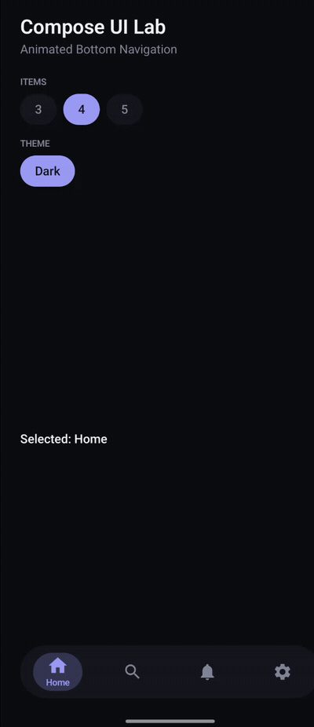

# Compose UI Lab

A showcase of custom Jetpack Compose components, built from scratch — no Material
components underneath. Each one is driven by a small design-token system, so the whole
library moves and looks consistent.


<!-- Record the running app (5–10s), export a light GIF, and drop it at docs/demo.gif -->

## Component 1 — Animated Bottom Navigation

A bottom navigation bar with a morphing, spring-driven indicator.

**What it demonstrates**
- Spring physics with a subtle overshoot (no linear tweens)
- A pill indicator that slides between destinations
- Per-icon color transition + a bouncy settle on selection
- Label revealed only for the active destination (expanding-pill feel)
- Custom press feedback (no Material ripple) + haptics on select
- Semantics for accessibility, works with 3–5 items, light & dark

**Built on a design-token layer**
`designsystem/token` defines `LabColors`, `LabTypography`, `LabSpacing`, `LabShapes`
and a central `LabMotion`. Components reference roles (e.g. `LabTheme.colors.accent`),
never raw values — the same approach used in production design systems.

## Tech

Jetpack Compose · Kotlin 2.0 · Material3 (icons/text only) · AGP 8.5 · minSdk 24

## Run

1. Open the project root in Android Studio (Koala or newer).
2. Let it sync — Android Studio brings its own JDK 17 and downloads Gradle 8.9.
3. Run the `app` configuration on a device or emulator.

> CLI builds: the project uses the Gradle wrapper. If `./gradlew` reports a missing
> `gradle-wrapper.jar`, generate it once with `gradle wrapper` (Android Studio's IDE
> sync does not need it).

## Project structure

```
app/src/main/java/com/uilab/showcase/
├── MainActivity.kt
├── designsystem/
│   ├── token/        (Color, Typography, Spacing, Shapes, Motion)
│   └── theme/        (LabTheme + CompositionLocals)
├── components/
│   └── bottomnav/    (LabBottomNav — component 1)
└── catalog/          (host + interactive demo screen)
```

## Roadmap

- [x] Animated bottom navigation
- [ ] Custom Canvas chart (line / donut)
- [ ] Swipeable card stack
- [ ] Morphing FAB
- [ ] Shimmer skeleton loaders

## License

MIT
